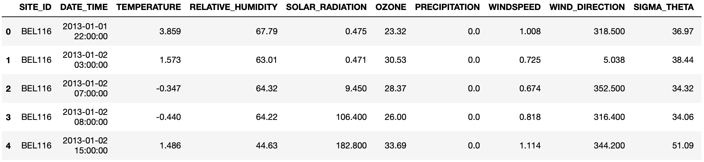
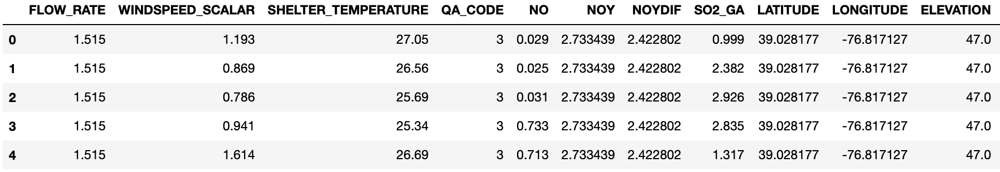
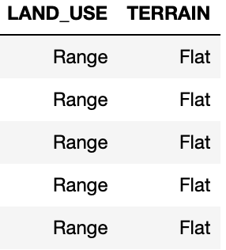

# Applied Machine Learning Project Deliverable 3

## Ozone Concentration Prediction
AML Group 24 Section 1: Andrea Lopez (apl2171), Naishadh Parmar (nnp2118), Guanyu Ho (gh2646), Duru Kahyaoglu (dk2565), Daniel Chang-Dae Pak (dcp2149)

### Data Sources

**Data Source Name**: CASNET EDA

**Description**: 
* Temperature: Temperature; degrees C.
* Relative Humidity: Percent of relative humidity.
* Solar radiation: Solar Radiation; watt/square meter.
* Precipitation: Precipitation; mm/hr.
* Wind Direction: Wind direction; decimal degrees.
* Flow rate: Flow rate, lpm.
* Windspeed: Vector wind speed; m/sec.
* Shelter temperature: Shelter temperature; degrees C.
* NO: NO, Nitrogen Oxide, Gas, concentration; ppb (parts per billion).
* NOY: NOy, Reactive Oxidized Nitrogen Compounds, Gas, concentration; ppb.
* NOYDIF: NOy Difference, Reactive Nitrogen Compounds Other Than NO, concentration; ppb.
* SO2_GA: SO2, Sulfur Dioxide, Gas, concentration; ppb.
* Latitude: The latitude of the site measurement was taken at; decimal degrees.
* Longitude: Longitude; decimal degrees.
* Elevation: elevation of the site; m.
* Month: month of the year, integer to represent the month.
* Agric: Whether the land is agricultural, Boolean (1 for positive).
* Forest: Whether the land is a forest or not, Boolean (1 for positive).
* Range: Whether the land has a range of different uses, Boolean, (1 for positive).
* Complex: Terrain that’s not just flat or complex, Boolean, (1 for positive).
* Flat: Terrain that’s flat, Boolean, (1 for positive).
* Rolling: Terrain where the natural slopes consistently rise above and fall below the road or street grade and where occasional steep slopes offer some restriction to normal horizontal and vertical roadway alignment, Boolean, (1 for positive).
    
**Data Summary**:
The purpose of this dataset is to be used to predict ozone concentration in the atmosphere.
* The dataset has data collected at 6 sites.
* The dataset contains 23 variables including 22 features and 1 label which is Ozone.
* There are 16 numeric variables: temperature , relative humidity, solar radiation, precipitation, windspeed, wind direction, windspeed scalar, sigma theta, flow rate, shelter temperature, NO, NOY, NOYDIF, SO2_GA, latitude, longitude, elevation, and ozone.
* There are 4 categorical variables: site ID, quality assurance code, land use, and terrain.
* There is 1 date-time variable which is date time.
* There are no missing values in the dataset.
* There are no duplicates in the dataset.
* The dataset contains negative values for the Experience, which need to be further processed.

**Objective**:

The purpose of this project/dataset is to predict the Ozone level and identify the most important features in it.

**File Format**: Parquet

**Data Collection Method**: The Clean Air Status and Trends Network (CASTNET) datasets are from United States Enviromental Protection Agency (EPA) website (https://gaftp.epa.gov/castnet/CASTNET_Outgoing/data/) and we used bash to find and extract those files from the website.

**Data Usage Restrictions**: Only those data points that are measured correctly with corresponding measurement labels could be used.

**Data Preprocessing**:
To get to this point, we did the following preprocessing of the raw data:
- We combined 3 datasets from CASTNET between the years 2013 to 2022: site, hourly gas, and meteorological data
- Filters were applied on the hourly gas dataset for excluding different parameters for gas measurements and including records that are valid measurements and have a high quality assurance level
After this point, we did the following preprocessing of our combined and cleaned data:
- Dropped irrelevant columns (QA assurance, site ID)
- Dropped highly correlated columns (windspeed, sigma theta)
- One hot encoded categorical variables (terrain and land use)
- Dropped the datetime column and created month and year features
- Scaled the data using Standard Scaler.
We were left with 22 features: temperature, relative humidity, solar radiation, precipitation, wind direction, flow rate, windspeed, shelter temperature, NO, NOY, NOYDIF, SO2_GA, latitude, longitude, elevation, month, Agric, Forest, Range, Complex, Flat, and Rolling.

**Sample Data**: 

